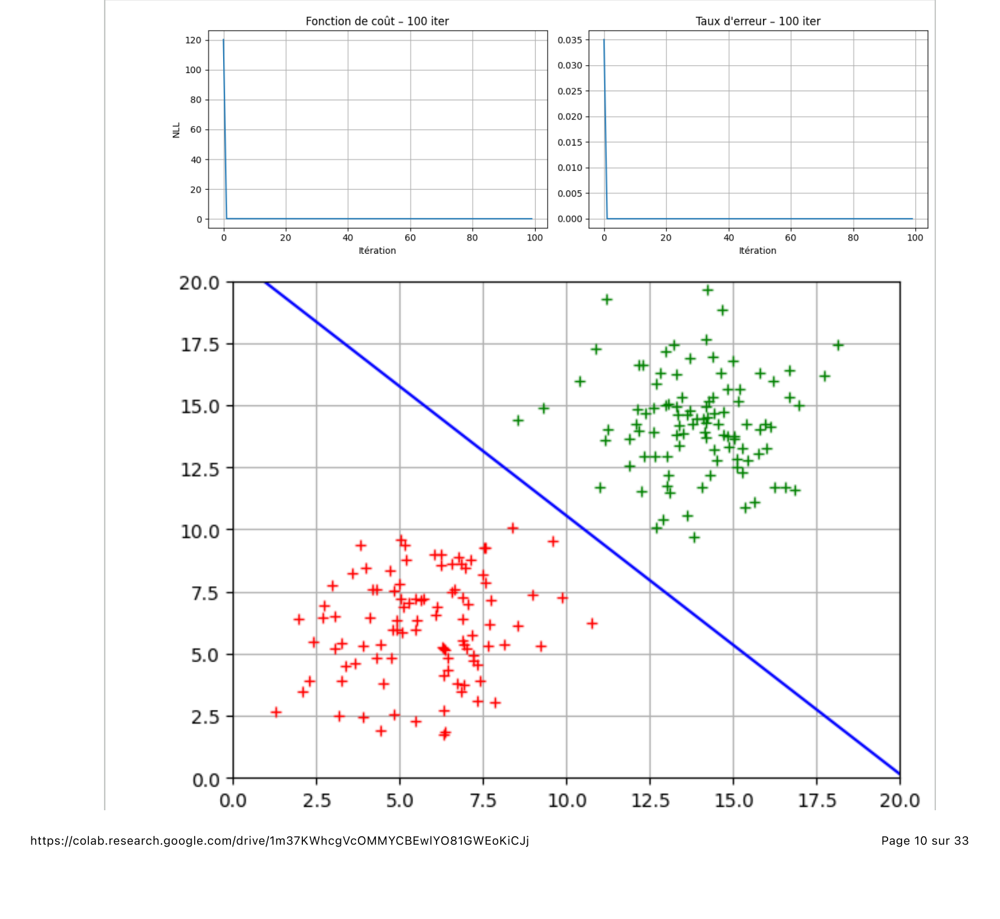
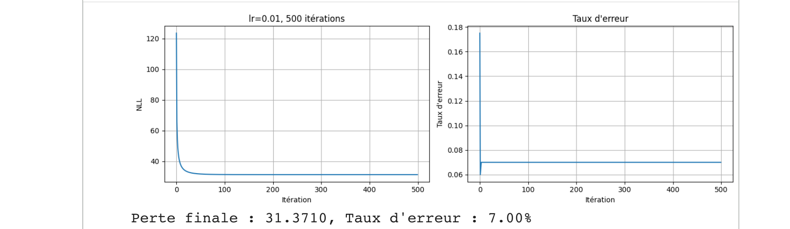
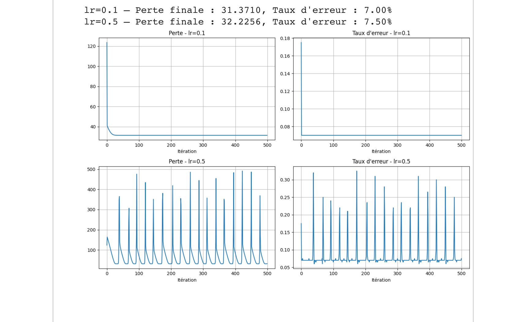
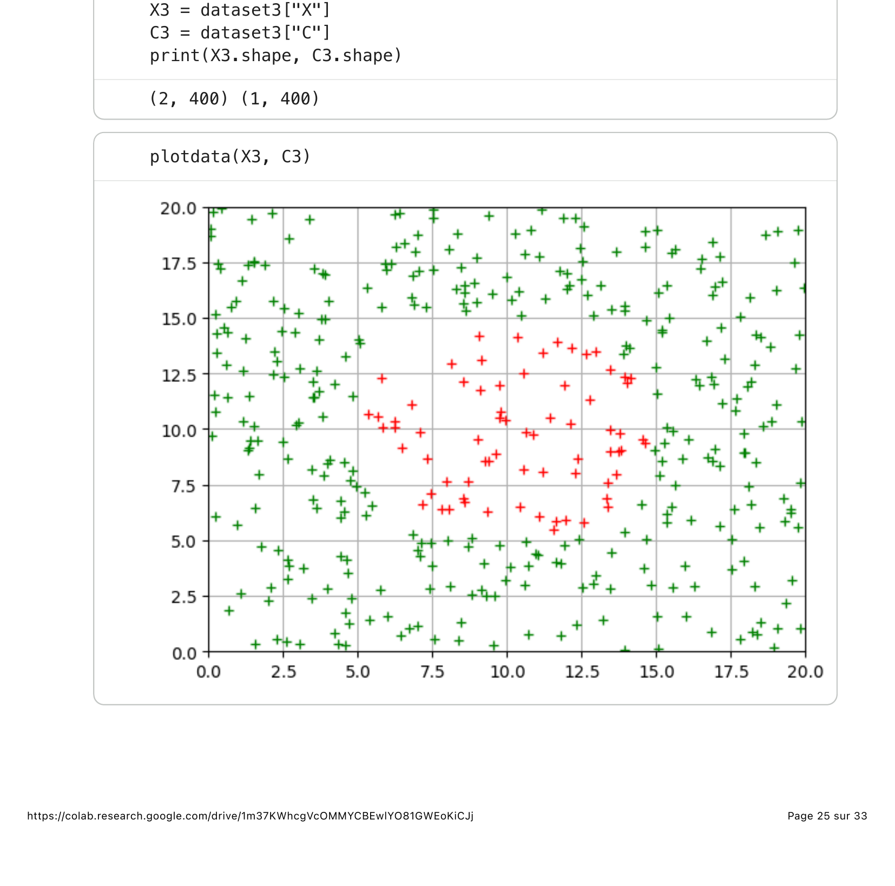
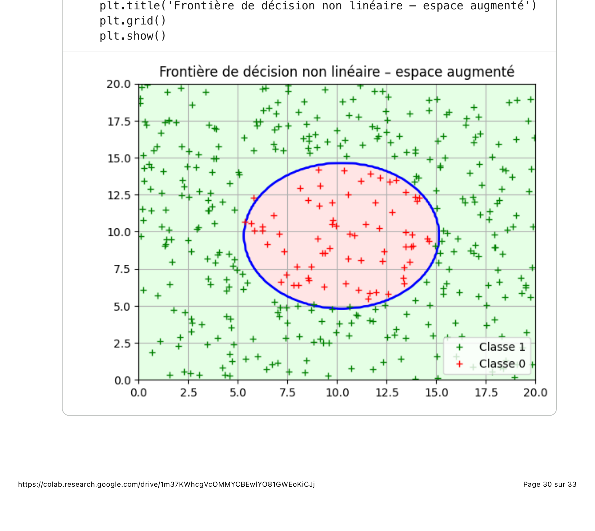

# TP Probabilités & Statistiques — Régression Logistique

Elias Bonnefoi — ESPCI Paris PSL, 1ère année (2025-2026)

## Contenu

- [`regression_logistique.py`](regression_logistique.py) — code Python (descente de gradient, régression logistique implémentée from scratch)
- `data/` — jeux de données `.mat` (`reglog_data_1.mat`, `reglog_data_2.mat`, `reglog_data_3.mat`), à ajouter localement (non versionnés, voir `.gitignore`)

## Le modèle

La régression logistique modélise la probabilité qu'un vecteur `x` appartienne à la classe 1
via un hyperplan séparateur et la fonction sigmoïde :

```
P(c=1|x) = σ(wᵀx + b) = 1 / (1 + exp(-(wᵀx + b)))
```

Les paramètres `(w, b)` sont appris par descente de gradient sur la perte de log-vraisemblance
négative (NLL) : `L(θ) = -Σᵢ [cᵢ·log P(cᵢ|xᵢ) + (1-cᵢ)·log(1-P(cᵢ|xᵢ))]`.

Le TP explore trois jeux de données 2D de complexité croissante.

## Dataset 1 — cas linéairement séparable



*Convergence de la perte (NLL) et du taux d'erreur, et frontière de décision apprise, avec
`lr = 0,1` sur données centrées-réduites.*

Avec `lr = 0,1`, la convergence est quasi-immédiate : dès 100 itérations, le taux d'erreur
tombe à 0 % (perte finale 0,1479). En poussant à 1000 puis 10 000 itérations, la perte
continue de décroître (0,0633 puis 0,0104) sans que le taux d'erreur ne change — la frontière
est déjà bien placée, seule la confiance du modèle (proximité des probabilités à 0 ou 1)
continue de s'affiner.

## Dataset 2 — classes qui se chevauchent légèrement



*Avec `lr = 0,01` sur 500 itérations : la perte converge, le taux d'erreur se stabilise à 7 %.*

Les deux nuages de points se chevauchent légèrement : aucune droite ne peut les séparer
parfaitement, d'où un taux d'erreur résiduel incompressible d'environ 7 %, indépendamment du
pas d'apprentissage.



*Effet du pas d'apprentissage : `lr = 0,1` (haut) converge proprement vers le même résultat
qu'avec `lr = 0,01`, mais bien plus vite. `lr = 0,5` (bas) fait largement dépasser le minimum
à chaque itération — la perte et le taux d'erreur oscillent fortement sans diverger sur ce
jeu de données.*

Une expérience complémentaire (`lr = 0,01`, 1000 itérations) montre que la **norme des
paramètres `√(w₀²+‖w‖²)` croît sans jamais se stabiliser**. Sur des données presque
linéairement séparables, le modèle peut toujours réduire la NLL en repoussant les
probabilités prédites vers 0 ou 1 (frontière de plus en plus « dure ») sans changer sa
position géométrique — il n'existe alors pas de minimum fini pour la NLL. C'est l'argument
qui motive en pratique l'ajout d'une régularisation L2.

## Dataset 3 — structure non-linéaire (classes concentriques)



*Les deux classes forment des ensembles concentriques : aucun hyperplan (droite en 2D) ne
peut les séparer.*

Sans surprise, la régression logistique classique échoue : perte finale 184,68, **taux
d'erreur ~17-20 %**, la frontière linéaire ne fait quasiment pas mieux qu'un tirage aléatoire
pondéré par les proportions de classes.

La solution retenue est un enrichissement des features (*feature engineering*) : comme les
classes sont concentriques, la distance au centre est discriminante. On construit
`φ(x) = [x₁-c̄₁, x₂-c̄₂, (x₁-c̄₁)²+(x₂-c̄₂)²]` et on réapprend une régression logistique dans cet
espace à 3 dimensions — un hyperplan dans cet espace augmenté correspond à un **cercle** dans
l'espace original.



*Frontière de décision dans l'espace augmenté (10 000 itérations, `lr = 0,01`) : perte finale
0,0362, taux d'erreur < 1 %. La frontière circulaire sépare nettement le cluster central de
la couronne extérieure.*

Cette idée d'enrichir « à la main » la représentation des données pour la rendre linéairement
séparable est un précurseur direct des réseaux de neurones, qui apprennent automatiquement ce
type de transformation non-linéaire.

## Remarque sur l'utilisation de l'IA

L'IA (Gemini) a été utilisée pour débugger certaines cellules de code, et accélérer l'écriture de certaines cellules de code comme la structure des graphiques. Son apport principal a été la mise en forme rapide du code NumPy/Matplotlib et la suggestion du clipping dans la fonction objectif (éviter log(0)). En revanche, l'IA a eu tendance à proposer des implémentations trop génériques (ex. utilisation de sklearn au lieu du code from scratch demandé) et à omettre la conversion des paramètres vers l'espace original pour la visualisation — ce que j'ai dû corriger manuellement.

## Dépendances

```bash
pip install numpy matplotlib scipy
```

## Exécution

```bash
python regression_logistique.py
```
